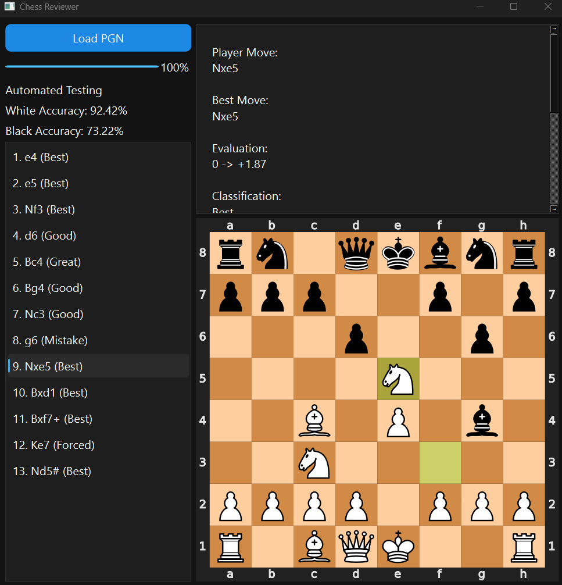
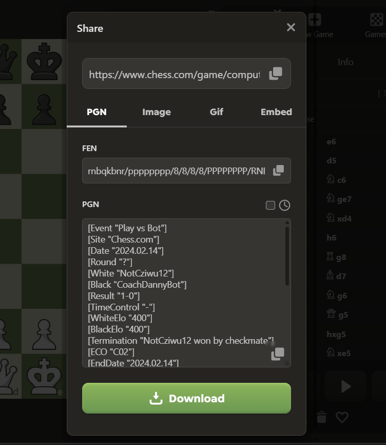
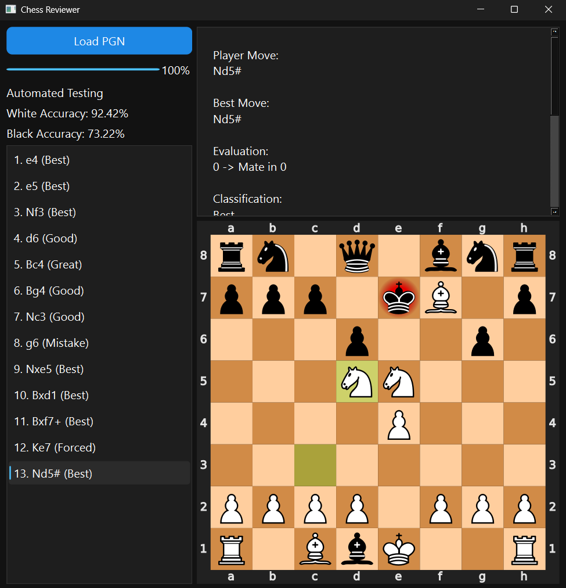

# chess.com style reviewer
my attempt at building a chess.com style reviewer. Ever since I starting to learn programming, specifically python, I have always wanted to build/replicate random shi that I find interesting on my own. Building a chess reviewer it one of those projects. It always frustrates me that I need to pay to review my game. I could analyse my game manually but i'm using this very fixable issue as an excuse to NOT continue learning CS50P bcs my laziness is ahh. Honestly just building the backend already taught me more on Python than CS50P combined (definetely not exagarating) so even though this is just the bare minimum and it's very ahh (very bad) according to my standards, im still proud that i tried. For some reason I also spent hours just learning and digesting how evaluation, especially move and game accuracy, works as it requires a good amount of math. And yes, this is just v1 and Ill improve the reviewer overtime. To the reader/user: i want your feedback, especially if you play chess. tell me how I could improve it. thanks

## Features
- Load PGN 
- Analysis from Stockfish Engine 
- Shows Engine Best Move
- Move Evaluation and Classification
- WDL Probability (Win/Draw/Loss)
- Game Accuracy  
- SVG Board
- Move and Check Highlights

## Installation

- Download and extract application
- Run 

## Usage 

### What you need:
- A PGN file

#### How to get PGN file

- Go to your games in Chess.com/Lichess/preferred chess platform 
- Click Share
- Select PGN and download the file

Now you have a PGN file of your game:

- Open the application and click on the "Load PGN" button
- Select your PGN file 
- Wait for it to analyse

## Interface Guide

### Left Side

- Load PGN: Load the PGN
- Event Label: Shows the header of the game
- White Game Accuracy: Shows white's game accuracy 
- Black Game Accuracy: Shows black's game accuracy 
- Move list (Bottom Left): List all moves in the game. Click on a move to show analysis result info

### Right Side

- Analysis Result (Top Right): Shows the output of from the engine. Shows Player and engine move, Evaluation, Classification (ranging from "Best" to "Blunder"), Move Accuracy and Win/Draw/Loss Percent
- SVG Board (Bottom Right): Shows an SVG board of the move. Highlights move in green and check in red.

## How it works

User sends in PGN file, then it's analysed by Stockfish. The output is then used to get Cp (centipawn), WDL Prob and the best engine move (along with some other info but not rlly necessary). Move accuracy is then calculated seperately using Lichesses formula for calculating move accuracy (an exponetial curve where the expectation score loss is overlayed onto the curve to get the accuracy value). Classification is also seperate using Cp score and Matescore to return a classification. I'm working on improving the classification system. After all of that the review game func returns a dict with all of the info to frontend to format an display. After the entire game is fully analysed, the game accuracy is calculated using the accuracy and overlaying onto a sigmoid curve (a curve with an s shape) to generate "weights". Game accuracy is then calculated using the sum of the weights times the accuracy divided by the number of moves (or accuracy percentages). This is not how platforms like chess.com calculate game accuracy so ill also be improbing this (ill probably imrpove this first).

## Limitations

The current version is ONLY the "bare minimum" of a chess reviewer. Currently it only analyses the game and returns some basic stats about the game. My vision for this reviewer is for it to be able to generate human explanations. Until i get my reviewer to my standard of a true and function reviewer then.

## Tech Stack

- Python
- PySide6
- python-chess
- Stockfish